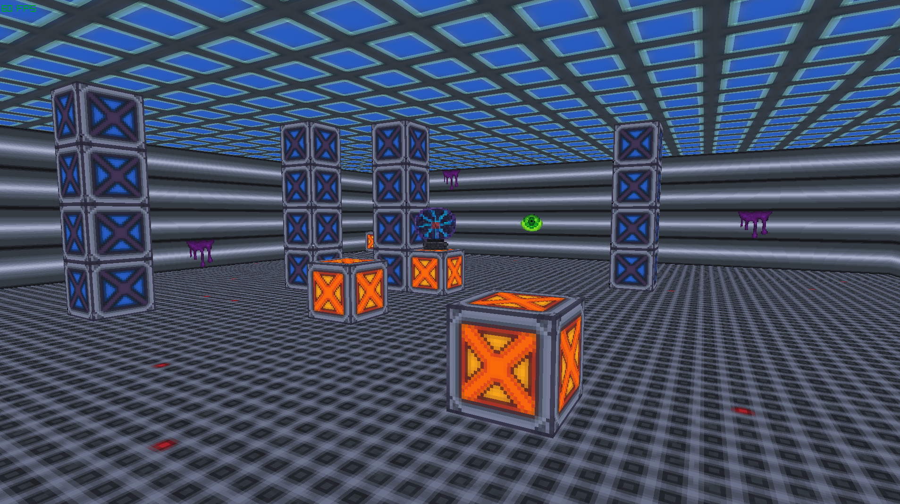

This is something I made with Odin and Raylib from a tutorial.
The code quality is very bad so don't use this as any kind of reference.
It simply shows what can be achieved with just a few lines of code.
When I have the time I plan to build on this to make a simple boomer shooter.

